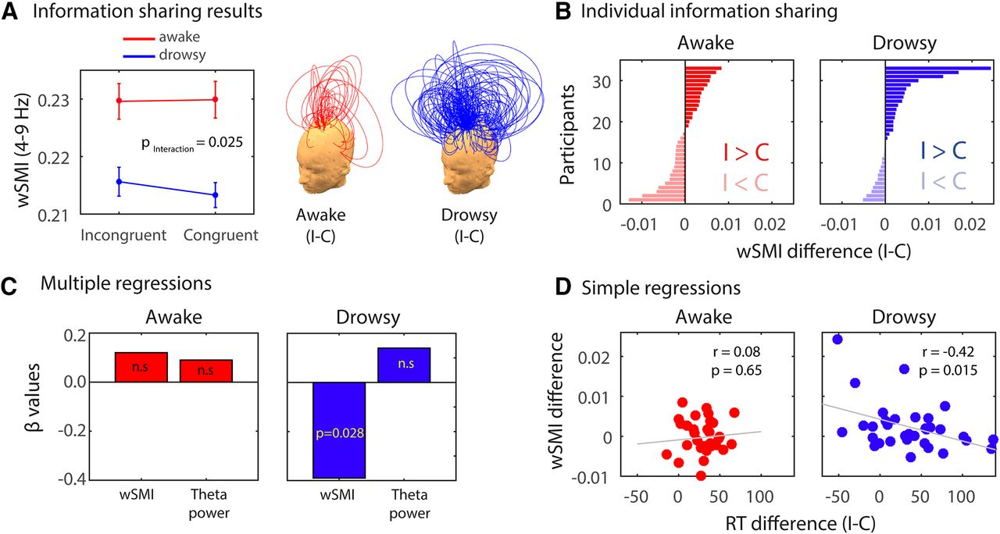

# Module 4 - Publication Quality Graphics

One of the main reasons to use Matlab is its extensive library of easy to use graphical commands. These commands allow you to visualize your analysis in a fast and (usually) straightforward way. Matlab's graphics are, certainly for rough plots, easy to use and intuitive. Although fine-tuning of graphs for publication can take up more time, it is worth investing to create graphs that need (at most!) minimal editing in a dedicated grahics program such as Adobe Ilustrator.

At the end of this module you should be able to:

- Use a range of built-in Matlab commands to visualize your data and analyses
- Create a graph that matches the requirements of a scientific journal

## Materials
1. The `./docs/Visualization.mlx` file describes some of the most common types of graphics used in neuroscience publications: line plots, bar graphs, violin plots, histograms, raster plots and PSTHs. It also describes how to fine-tune your graphs and how to export them - ready to submit to a journal. 
1. There are several packages on GitHub that help produce quality graphics. For instance, a package dedicated to [violin plots](https://github.com/bastibe/Violinplot-Matlab.git) or an even more extensive tool called [gramm](https://github.com/piermorel/gramm). Have a look at their documentation, clone them to your machine, and use them throughout this course and for your future projects.

## Assignments
The assignment for this week is to prepare a figure for publication in the Journal of Neuroscience. Rather than using your own data/visualization, you have to reproduce a specific, already published panel from a figure.  Note that you should not redo any analysis; this is an exercise to master the details of graphics, not analysis.  You should recreate the figure based on the values/settings/fonts/colors that you extract (or estimate) from the published figure.

Follow these steps:

1. The figure you are to reproduce is Panel D from this complex figure (you can get it from [the original source](https://www.jneurosci.org/content/40/37/7142/tab-figures-data)):

Note that you should **only reproduce panel D**.
1. Download [GrabIt](https://www.mathworks.com/matlabcentral/fileexchange/7173-grabit) from the Mathworks File Exchange and use it to extract the locations of the data points and other markers from the example figure. Store these numbers in a .mat file, and add it to the ./data folder of this repository. 
1. Edit `./code/reproduceFigure5D .m` to create a script that reads the data you extracted with GrabIt and then reproduces Panel D.  Everything has to match the figure and the instructions for authors from the Journal of Neuroscience. This includes Fonts  (Arial), Fontsizes (10), and printed figure size, [as documented here](https://www.jneurosci.org/content/information-authors#preparing_a_manuscript). (Tip: print or export the figure to PDF to check that the sizing is correct).
1. The built-in `annotation` function can come in handy; especially when combined with the `./code/ds2nfu.m` function in the repository. 
1. The script should save a PNG and PDF output format file to the `./docs` folder 
1. Check that your script follows the Matlab style guide, uses meaningful variable names and has appropriate documentation both at the top and inline with the code. 
5. Add the data, PNG figure, and any code you wrote to the repository, commit, push, and issue a pull-request. 

